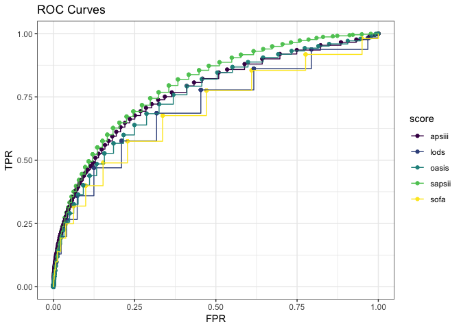

```{r setup, include=FALSE}
knitr::opts_chunk$set(echo = TRUE)
```

## Summary

We used the MIT LCP  to generate severity scores and detailed ICU data for the >50,000 patients in this dataset from their chart events in the ICU. We also used AHRQ's ICD code classification system to generate high-level classification of diagnosis for later manipulation in our interactive [Shiny webapp](https://mimicroc.shinyapps.io/severity-scores-analysis). We evaluated the different severity scores first through an intuitive visualization, and then through an AUROC analysis, making use of predictions imputed in the case of SAPSII by a published literature value and, for other scores, through a mainterm logicstic regression. An AUROC analysis maximizes the ratio of true positives to false positive through every possible "cutoff" value for a continuous-probability test; i.e., if an algorithem were to classify an outcome based on different levels of probability, the false positive rate and true positive rate would change. A algorithm with good discrimination will quickly maxi the true positive rate vs. false positive rate as your threshold for classification changes. We find this type of analysis applicable to the clinical use case; given that different clinicians, programs, or systems may assign different interpretations to the same severity, a useful algorithm will quickly be "better than chance" throughout its range. Our AUROC analysis resulted in SAPSII being the most predictive severity score. 

Following this, we revisited an earlier question of interest-- do demographic factors affect outcomes--through two means: first, we investigated whether adding additional terms to the model improved the SAPSII prediction, through our earlier "intuitive" graph and an AUROC analysis. We found a marginal improvement in AUROC when adding an interaction term with admission type (emergency or elective), and a log-likelihood test found the additional terms added to be significant. However, our main conclusion was how quickly models are muddied in interpretability by adding additional terms, which was a useful exploration of the principle of parsimony. To close our project, we found that a less certain, but more visualization-rich would be a useful addition to this research question, and we created a [Shiny dashboard](https://mimicroc.shinyapps.io/severity-scores-analysis) wherein users can explore the effect of different diagnoses (from the top 50 most common diagnostic categories), insurance types, and age on observed deaths and the ROC curves for the severity scores. (N.b.: this also serves as an exploration of how sample size affects evaluation of algorithms).

## Results

### ROC curves for Severity Scores
```{r, echo=FALSE}

```

### Probability vs Proporition for Severity Scores

```{r, echo=FALSE}
knitr::include_graphics("./images/plot 2-1.png")
```

### ROC curve for Admission Type Addition

```{r, echo=FALSE}
knitr::include_graphics("./images/unnamed-chunk-18-1.png")

```


